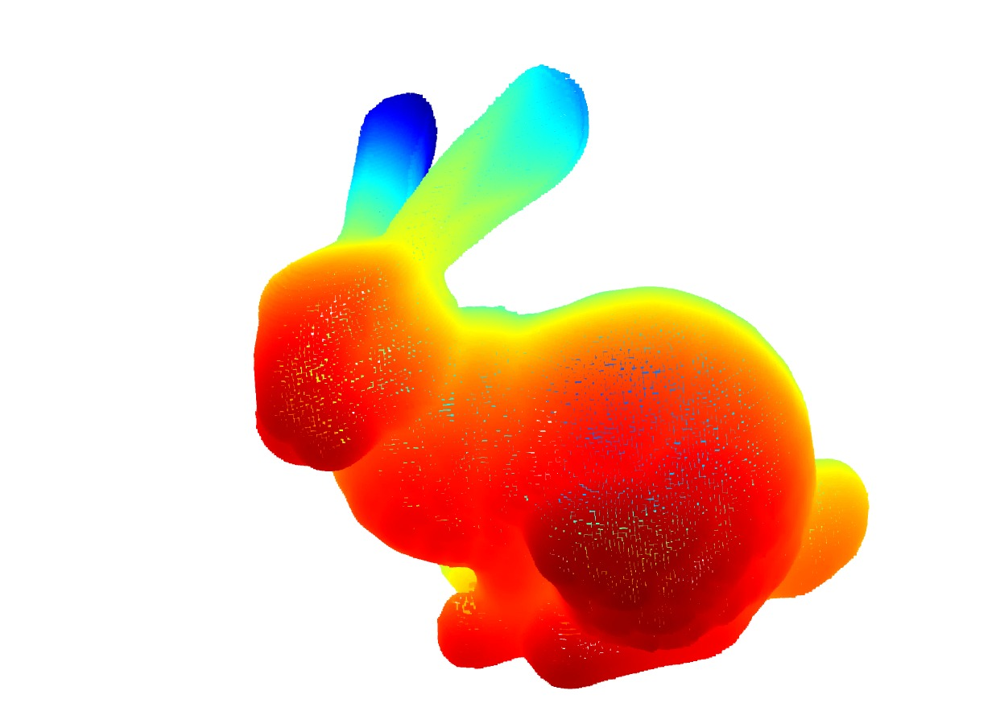
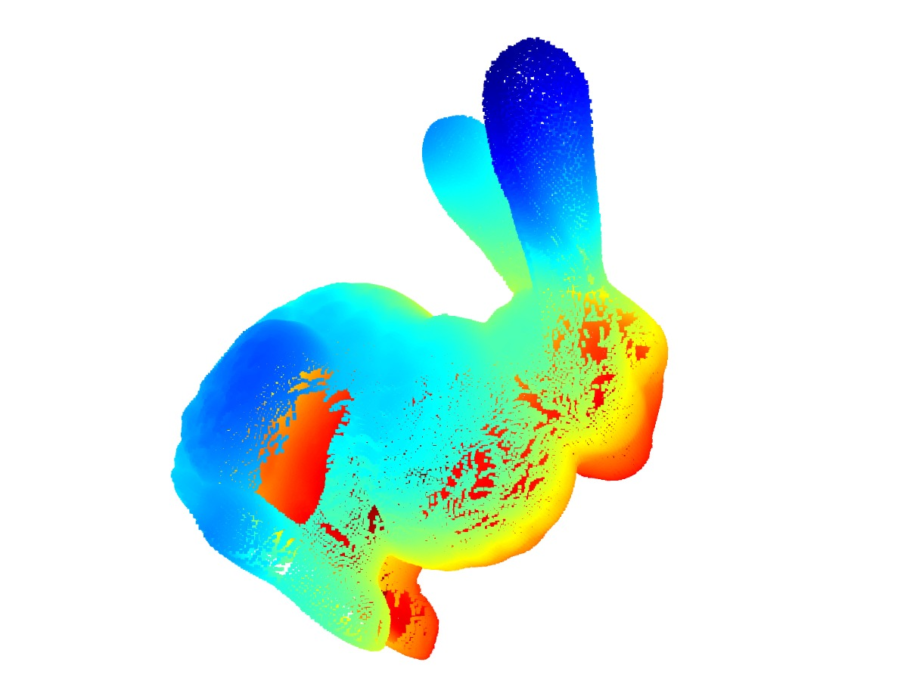
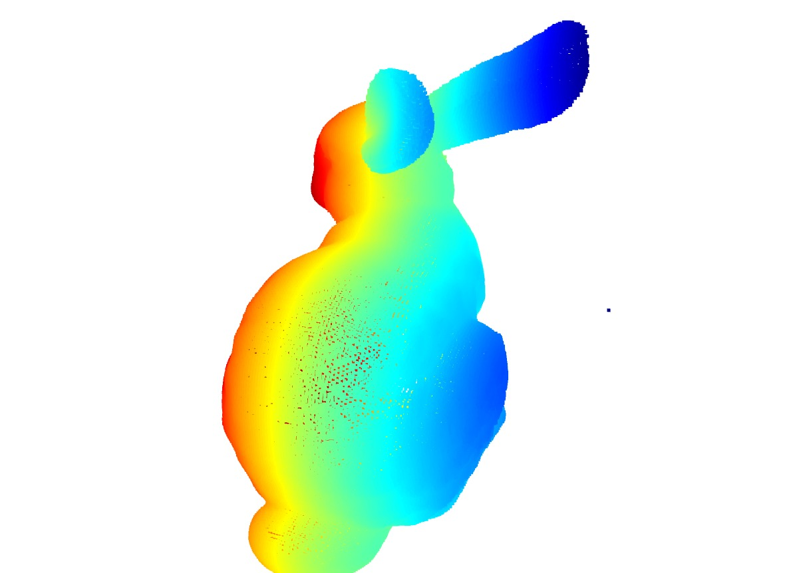

## FGR Method

### Method Used

- The scans were downsampled using voxel downsampling with voxel length 0f 0.003.This parameter allows us to control the point density.

- FPFH extraction
- Fast Global Registration
- Point to Plane ICP refinement

### Challenges faced

#### Randomness
 - The FGR library used in open3d does some complex optimization as a result for the same code some runs produced perfect registration and some runs produced distorted image.

#### Incremental Merging

 - This method use incremental merging. That is bun05 is merged with bun000. now bun090 is merged with the combination of (bun000+bun045). As a result on merging bun180 to bun090 possibly dues to the sharp 90 degree turn registration fails for bun180 and bun270. 

 ## Observations
 - Visually FGR output produced convincing results. ICP refinement made only tiny improvement in many mergings. Had i done the same without ICP I may have gotten a similar scan possibly.

 - FGR library produced randomness for same code on different runs. When i checked found out that this was due to some optmization inside the library. Pair wise scans which i have sent before worked well for any pair in the dataset.Randomness creeps in only when merging the full dataset.

 - During the merging process in some cases the Fitness scoe produced by FGR were very low (0.20,0.39.0.32). But ICP boosted the fitness to above 0.6 range benefitting the registration. I am tabulating this below.

| Scan     | FGR  | ICP  |
| -------- | ---- | ---- |
| bun045   | 0.92 | 0.91 |
| bun090   | 0.20 | 0.65 |
| bun315   | 0.86 | 0.84 |
| top2     | 0.39 | 0.69 |
| top3     | 0.85 | 1.00 |
| chin     | 0.76 | 0.76 |
| ear_back | 0.32 | 0.99 |

## Problem left
 The scans bun180 and bun270 could not be merged with the scan without causing distortion. as a result some areas which were to be filled by these were left with holes. Need to figure out a solution for this.I am attaching the images below. 

 
 
 
