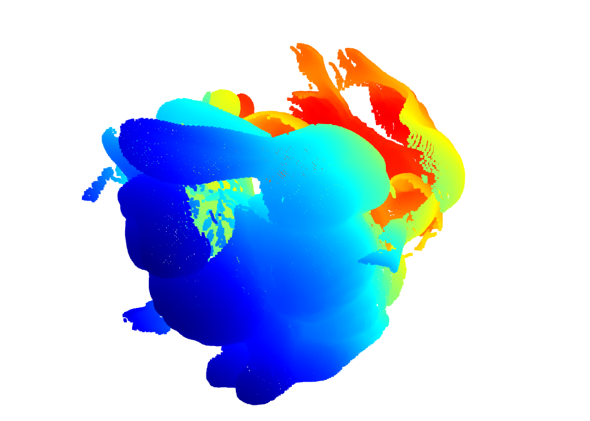

# Point Cloud Registration Pipeline Using 3D-SIFT, FPFH, RANSAC, ICP and Robust ICP

## 1. Dataset Preparation

The Stanford Bunny dataset consists of multiple scans captured from different viewpoints:

```text
bun000.ply
bun045.ply
bun090.ply
bun180.ply
bun270.ply
bun315.ply
```
## 2. 3D-SIFT Inspired Keypoint Detection

### Objective
To extract distinctive geometric feature points from each point cloud scan for subsequent matching and registration.

Open3D doesnt have 3D-SIFT implementation. So instead i tried to make a simple version 


### Scale-Space Construction
A multi-scale representation of the point cloud is generated using Gaussian-weighted neighborhood smoothing at multiple scales:

$$
\sigma_1 = \sigma,\quad
\sigma_2 = k\sigma,\quad
\sigma_3 = k^2\sigma
$$

where:

$$
k = 1.414
$$

### Difference of Gaussian (DoG)
To detect significant geometric variations across scales, Difference of Gaussian responses are computed as:

$$
DoG_1 = L_2 - L_1
$$

$$
DoG_2 = L_3 - L_2
$$

Points with strong DoG responses correspond to regions exhibiting prominent local geometric changes.

### Keypoint Detection

For each point, neighboring points are obtained using a k-d tree. A point is selected as a keypoint if its DoG response is a local maximum or minimum among its neighbors and exceeds a predefined contrast threshold.

The resulting keypoints represent geometric structures such as corners, protrusions, and high-curvature regions.

### Output
The extracted keypoints are saved as .ply files and used for FPFH descriptor stage. Files are named as

```text
bun000_keypoints.ply
bun045_keypoints.ply
bun090_keypoints.ply
bun180_keypoints.ply
bun270_keypoints.ply
bun315_keypoints.ply
chin_keypoints.ply
ear_back_keypoints.ply
```

## 3. Feature Description and Correspondence Matching

### Objective

This stage is to describe the extracted keypoints using local geometric features and establish correspondences between consecutive point cloud scans.

### Normal Estimation

For each detected keypoint, surface normals are estimated using neighboring points obtained through a k-d tree search.

These normals capture the local surface orientation and are required for feature descriptor computation.

The local covariance matrix is computed as:

$$
C =
\frac{1}{N}
\sum_{i=1}^{N}
(p_i-\bar{p})(p_i-\bar{p})^T
$$

where:

- \(p_i\) = neighboring point
- \(p̄\) = neighborhood centroid

The eigenvector corresponding to the smallest eigenvalue of the covariance matrix is selected as the surface normal.

### FPFH Descriptor Computation

Fast Point Feature Histograms (FPFH) are computed for every keypoint.

FPFH encodes the local geometric structure around a point by analyzing the angular relationships between neighboring surface normals. The resulting descriptor is a 33-dimensional feature vector that characterizes the local surface geometry.

### Descriptor Matching

For each source keypoint descriptor, the Euclidean distance to all target descriptors is computed:

$$
d(i,j)=\|f_i-f_j\|
$$

where:

- \(f_i\) = source FPFH descriptor
- \(f_j\) = target FPFH descriptor

The target descriptor with the minimum distance is selected as the best correspondence:

$$
j^*=\arg\min_j d(i,j)
$$

### Correspondence Matrix Generation

Matched keypoint pairs are stored in a correspondence matrix of the form:

$$
[source\_index,\ target\_index]
$$

Each row represents a correspondence between a source keypoint and its nearest matching keypoint in the target scan.

### Output

The generated correspondence matrices are saved and later used for point cloud registration, transformation estimation, and ICP refinement.

I didnt include the chin and ear_back files for simplicity.

The following scan pairs were registered:
```text
- 000 ↔ 045
- 045 ↔ 090
- 090 ↔ 180
- 180 ↔ 270
- 270 ↔ 315
```

```text
Output files
correspondence_000_045.npy
correspondence_045_090.npy
correspondence_090_180.npy
correspondence_180_270.npy
correspondence_270_315.npy
```
## 4. RANSAC-Based Initial Registration

### Objective

This stage is to estimate an initial rigid transformation between consecutive point cloud scans using the correspondences obtained from FPFH.

### Correspondence Loading

For each scan pair, the previously generated correspondence matrix is loaded. Each correspondence represents a matched keypoint pair between the source and target point clouds.

### RANSAC Registration

The correspondence set is provided to Open3D's RANSAC registration algorithm to estimate a rigid transformation between the two scans.

The transformation consists of a rotation matrix \(R\) and translation vector \(t\):

$$
T =
\begin{bmatrix}
R & t \\
0 & 1
\end{bmatrix}
$$

A maximum correspondence distance of 0.01 units is used to determine valid inlier matches during registration.

### Transformation Estimation

Using the correspondence pairs, RANSAC computes the transformation matrix that best aligns the source keypoints with the target keypoints while rejecting inconsistent matches.

### Registration Evaluation

The quality of the estimated transformation is evaluated using:

- **Fitness**: Ratio of inlier correspondences to total correspondences.
- **RMSE**: Root Mean Square Error of the inlier correspondences after transformation.

### Output

For each scan pair, the estimated transformation matrix, fitness score, and RMSE value are stored in a JSON file.


```text
Output files
transform_000_045.json
transform_045_090.json
transform_090_180.json
transform_180_270.json
transform_270_315.json
```
## 5. ICP-Based Registration Refinement

### Objective

This stage is to refine the initial alignment obtained from the RANSAC registration stage and achieve a more accurate registration between consecutive point cloud scans.

### Initial Alignment

The transformation matrix estimated by RANSAC is used as the initial pose for ICP. This provides a coarse alignment between the source and target point clouds.

### Iterative Closest Point (ICP)

The Point-to-Point ICP algorithm is applied to the original point clouds.

For each iteration:

1. The closest point in the target cloud is found for every source point.
2. A rigid transformation is computed.
3. The source cloud is transformed and re-aligned.
4. The process repeats until convergence.

The transformation consists of a rotation matrix \(R\) and translation vector \(t\):

$$
T =
\begin{bmatrix}
R & t \\
0 & 1
\end{bmatrix}
$$

ICP refines this transformation by minimizing the distance between corresponding points:

$$
E = \sum_{i=1}^{N}
\|Rp_i + t - q_i\|^2
$$

where:

- \(p_i\) = source point
- \(q_i\) = corresponding target point
- \(R\) = rotation matrix
- \(t\) = translation vector

### Registration Evaluation

The registration quality is evaluated using:

- **Fitness**: Fraction of points successfully matched within the correspondence threshold.
- **RMSE**: Root Mean Square Error between matched point pairs after alignment.

### Output

The refined transformation matrix, fitness score, and RMSE value are stored for each scan pair.


```text
Files
icp_000_045.json
icp_045_090.json
icp_090_180.json
icp_180_270.json
icp_270_315.json
```
## 6. Robust ICP Registration

### Objective

The objective of this stage is to further refine the ICP alignment while reducing the influence of incorrect correspondences and outlier points.

### Normal Estimation

Surface normals are estimated for both source and target point clouds. These normals are required for point-to-plane registration.

### Point-to-Plane ICP

The transformation obtained from the previous ICP stage is used as the initial alignment.

Unlike point-to-point ICP, point-to-plane ICP minimizes the distance between a source point and the tangent plane of the corresponding target point:

$$
E = \sum_{i=1}^{N}
\left( n_i^T (Rp_i + t - q_i) \right)^2
$$

where:

- \(p_i\) = source point
- \(q_i\) = target point
- \(n_i\) = normal vector at the target point
- \(R\) = rotation matrix
- \(t\) = translation vector

### Robust Loss Function

A Tukey Loss function is applied during optimization to reduce the influence of outliers.

Points with large alignment errors receive lower weights, preventing incorrect correspondences from significantly affecting the final transformation estimate.

### Registration Evaluation

The refined registration is evaluated using:

- **Fitness**: Fraction of points successfully aligned within the correspondence threshold.
- **RMSE**: Root Mean Square Error of the inlier correspondences.

### Output

The final refined transformation matrix, fitness score, and RMSE value are stored for each scan pair.

These transformations are subsequently used for global alignment and reconstruction of the complete Stanford Bunny model.

```text
Files
final_000_045.json
final_045_090.json
final_090_180.json
final_180_270.json
final_270_315.json
```
## 7. Reconstruction

### Objective

The objective is to reconstruct a complete 3D model of the Stanford Bunny by combining all registered point cloud scans into a common coordinate system.

### Transformation Accumulation

The pairwise transformations obtained from the Robust ICP stage are combined to compute the cumulative transformation of each scan with respect to the reference scan (`bun000`).

The cumulative transformations are computed as:

$$
T_{045}=T_{000\rightarrow045}
$$

$$
T_{090}=T_{045}\cdot T_{045\rightarrow090}
$$

$$
T_{180}=T_{090}\cdot T_{090\rightarrow180}
$$

$$
T_{270}=T_{180}\cdot T_{180\rightarrow270}
$$

$$
T_{315}=T_{270}\cdot T_{270\rightarrow315}
$$
Similarly, cumulative transformations are computed for all remaining scans.

### Scan Alignment

Each point cloud is transformed using its corresponding cumulative transformation matrix:

$$
p' = Tp
$$

where:

- \(p\) = original point
- \(T\) = cumulative transformation matrix
- \(p'\) = transformed point

This aligns all scans into a common reference frame.

### Point Cloud Merging

After alignment, all transformed point clouds are merged into a single point cloud:

$$
P_{merged}
=
P_{000}
\cup
P_{045}
\cup
P_{090}
\cup
P_{180}
\cup
P_{270}
\cup
P_{315}
$$

The resulting point cloud contains information from all viewpoints of the bunny.

### Voxel Downsampling

To remove redundant points and reduce point cloud density, voxel downsampling is applied with a voxel size of 0.001.

This produces a cleaner and more compact reconstruction while preserving the overall geometry.

### Output

The final merged point cloud is saved as:

```text
reconstructed_bunny.ply
```



## Limitations 

Since Open3D doesnt have a 3DSIFT library, errors might have accumulated due to the imperfection of my custom implemented 3DSIFT. As a result slightly distorted reconstruction is obtained

